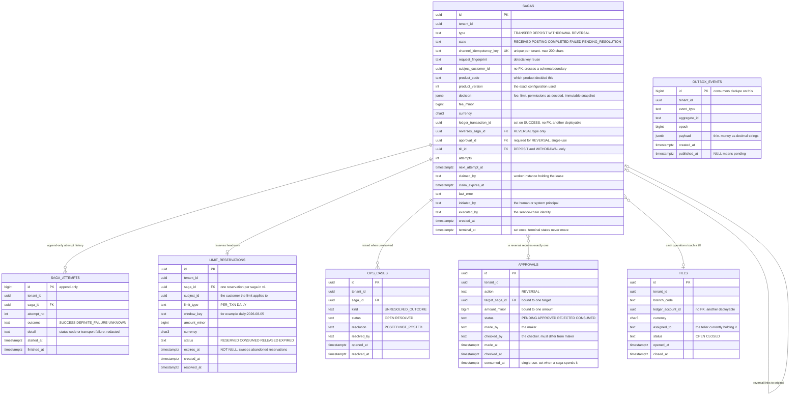
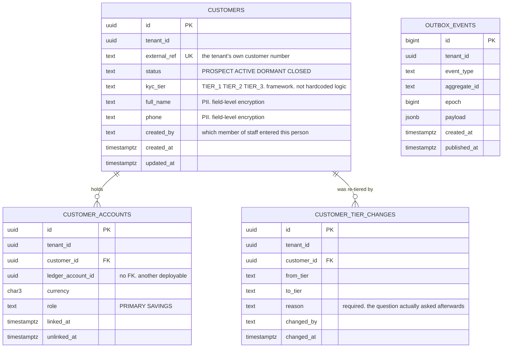
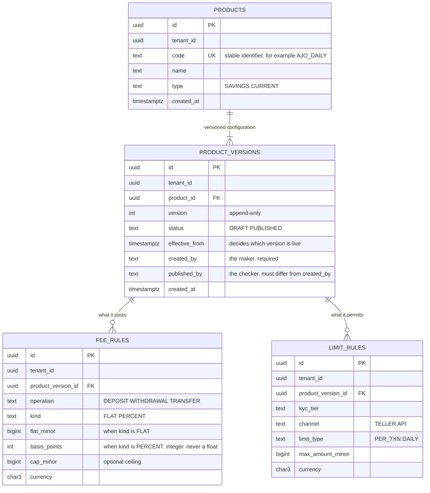

# Core — Data Model

**Status:** AGREED v2.0 (2026-08-11) — amendments via [`CHANGELOG.md`](CHANGELOG.md)

One database, three schemas, one database role per schema. Amounts are integer
minor units (`BIGINT`), `tenant_id` on **every** row.

## The rule that makes extraction possible

**No foreign key ever crosses a schema boundary.**

`orchestration.sagas` references a customer by id, but there is no foreign key to
`customer.customers`. Existence is validated through the module's interface at
the time of use, not by the database at write time.

This is the single most important constraint in this document. A cross-schema
foreign key would make `pg_dump --schema=customer` produce something that cannot
be restored independently — which would quietly convert the extraction path
[ADR 0006](../../../docs/adr/0006-modular-core.md) rests on into a rewrite. The
constraint costs a little referential integrity today and preserves the option
the whole packaging decision depends on.

References to the Ledger (`ledger_account_id`, `ledger_transaction_id`) are
foreign keys to another deployable's database and are therefore plain columns by
necessity. The rule above simply extends the same discipline to module
boundaries.

---

## Schema `orchestration`

**Decided rules:**

- `sagas.channel_idempotency_key` is **unique per tenant** and is the arbiter of
  duplicate submissions. The index decides races; application code does not.
- `decision` is an **immutable snapshot** taken at Phase A. Product
  configuration changes afterwards must never alter what a past saga is
  understood to have decided — this is what makes a completed transaction
  explicable to an examiner a year later.
- `saga_attempts` is **append-only**, trigger-enforced. It is the audit record of
  every outbound attempt including the unknowns, which is precisely the history
  an incident review needs.
- **Terminal states are terminal**, trigger-enforced: once `terminal_at` is set,
  `state` cannot change.
- `claim_expires_at` is the lease. See [`saga-protocol.md`](saga-protocol.md).
- **No PII in this schema.** `subject_customer_id` is an opaque reference.
- `last_error` and `saga_attempts.detail` are **redacted before storage** — a
  partner's error body may contain data this schema is not permitted to hold.
- **An approval is bound and single-use.** `(target_saga_id, amount_minor)` fix
  what it authorizes, `consumed_at` makes it spendable once, and a CHECK enforces
  `checked_by <> made_by`. An approval that could be replayed, or applied to a
  different amount, is not maker-checker — it is a token that happens to have two
  names on it.
- **No `epoch_at_post` column, deliberately.** An earlier draft carried one so a
  ledger restore could be detected automatically. It was removed because Core
  cannot fill it: the Ledger stamps its epoch on published events only, never on
  API responses, and Core consumes no events in v1. A column no writer can
  populate is worse than an absent one — it reads as a capability. Post-restore
  reconciliation is operator-triggered and mechanical instead
  ([`saga-protocol.md`](saga-protocol.md)); the column returns when Core consumes
  events, or sooner if the Ledger exposes its epoch on responses.
- **`tills` is a deliberate v1 simplification.** A till is a ledger account and
  not a customer, and there is no Branch domain yet. It lives here because the
  money path needs it, and it moves when that domain exists — recorded in
  [`design.md`](design.md) as a deferral with a stated move trigger — the teller
  application — so it is a placement decision rather than an accident.

### Columns that arrived with ADR 0012 and the trust fixes

- `tills.unit_id UUID` — the validated branch, beside the human-legible
  `branch_code`. Nullable: rows predating the migration carry none.
- `approvals.made_in_unit TEXT`, `approvals.checked_in_unit TEXT` — sorted,
  comma-joined snapshots of the signer's `units` claim at the moment of
  signature. Attribution, never authorization.
- `product.fee_rules.fee_account_id UUID` — the fee-income account is pricing,
  versioned and maker-checked like the rest of it. Nullable, because published
  versions are immutable and cannot be edited into carrying it; Orchestration's
  documented fallback (the caller's account) applies only to those.

## Schema `customer`

- **This is the only schema holding PII**, and the only one requiring field-level
  encryption. That concentration is deliberate: it is what makes Customer the
  first extraction candidate when a process-level boundary is required.
- KYC tier is a **value from a configurable framework**, not a hardcoded
  enumeration of CBN's three tiers. The tiers and their limits are Product
  configuration (PRD §3.1).
- `customer_accounts` is the customer↔ledger mapping. The Ledger holds only an
  opaque `customer_ref` and knows nothing about people; this table is where the
  association actually lives.
- **One live holder per account, as a partial unique index** on
  `(tenant_id, ledger_account_id) WHERE unlinked_at IS NULL`. It was first
  written as `UNIQUE (tenant_id, ledger_account_id, unlinked_at)` and did not
  work: a live link has `unlinked_at IS NULL`, PostgreSQL treats NULLs as
  distinct in a UNIQUE constraint, and two live holders inserted happily. The
  distinction matters because `holdsAccount` is asked on every transfer and
  every cash operation, and with two rows "who holds this account" has two
  answers. Unlinked history stays unconstrained — an account may be held,
  released and held again, and each of those is a real row (customer `V4`).
- `customer_tier_changes` is **append-only**, enforced by trigger. A KYC tier is
  the ceiling on what someone may move, so a tier change is a limit change; a
  reason is required, and a change to the tier already in force is refused
  rather than recorded so the trail is not padded with non-events. It lives here
  rather than in a platform-wide audit log because it is PII-adjacent and
  belongs on this side of the boundary (ADR 0006).

## Schema `product`

- **Version selection is unambiguous:** the applicable row is the highest
  `version` whose `effective_from` has arrived. `version` orders history and
  breaks ties; `effective_from` decides which is live. The same rule the ledger
  uses for tenant configuration, deliberately — one rule, learned once.
- **Percentages are integer basis points**, never a decimal or float. A
  percentage applied to money is a money calculation and hard rule 1 applies.
- `product_versions` is **append-only**. A published version is never edited; a
  change is a new version. Signed-off configuration must stay reconstructible.
  The trigger enforcing this is not a formality: it refused the first draft of
  the migration that added `created_by`, which had tried to backfill published
  rows with an `UPDATE`. A migration is exactly the privileged path that quietly
  edits signed-off configuration, and it was stopped like any other writer.
- **So are a published version's rules** — `fee_rules` and
  `limit_rules`, since `V7__published_rules_are_immutable.sql` (v1.24). The V2
  trigger fired on `product_versions` alone, so for six migrations the header row
  was immutable while the rows carrying the actual price were not. Nothing
  exercised it because nothing outside the test suite wrote them; the rule-authoring
  endpoints made it reachable. Java refuses these writes too, and the trigger is
  what makes the refusal survive a refactor — the same reasoning as the row above,
  applied one table down.
- **The publisher of a version may not be its author** —
  `publisher_differs_from_author`, mirroring `checker_differs_from_maker` on
  `orchestration.approvals` because it is the same rule about a different
  subject. Fees and limits live in a product version, so one person drafting and
  publishing alone can raise a ceiling and price against it unsupervised. The
  control is not in Orchestration's `approvals` table: Product may not depend on
  Orchestration, and an approval there is bound to a saga id and an amount,
  neither of which a version has. Two names on one row is the whole mechanism
  the property needs.
- v0 implements FLAT and PERCENT fees and PER_TXN/DAILY limits only. The
  declarative rule model in PRD §4.3 (tiered, capped, per-event, interest
  accrual) is deliberately deferred — recorded as a decision in
  [`design.md`](design.md). The deferral is made safe by the seam:
  `ProductDecisionService` returns a decision object rich enough that adding
  rule kinds changes the evaluator, never the call sites.

---

## Schema `organization`

The tenant's operational structure (ADR 0012). Two tables, and a deliberate
absence: no legal-entity fields, no accounting-book fields, no jurisdiction
fields — a unit answers "which part of the institution performed the work" and
nothing else.

**`organizational_units`** — a tree. `unit_type` is a CHECKed vocabulary
(`BRANCH`, `REGION`, `COUNTRY_OPERATION`, `BUSINESS_LINE`, `CENTRE`,
`AGENT_NETWORK`, `DIGITAL_CHANNEL`, `OPERATIONS_TEAM`): limit rules and
reporting will group by it, so a new kind is a migration plus an amendment,
never a free string. `code` is the stable human-legible handle — what token
`units` claims carry and what tills reference — unique per tenant **including
closed units**: a reused code would make an old till's branch ambiguous in an
audit. `parent_unit_id` is a composite self-reference, so a unit can only hang
under its own tenant's tree. Closing a unit stamps it and leaves its history
attributed to it.

**`unit_assignments`** — who works where, attributed both ways
(`assigned_by`, `revoked_by`). The principal is spelled exactly as tokens
spell it, so audit and claim join without translation. One live assignment per
principal per unit, arbitrated by a partial unique index; revocation keeps the
row. This table is the system of record from which identity provisioning
derives the token's `units` claim — enforcement reads the claim, audit reads
this table, and until identity sync exists the gap between them is maintained
by an administrator and stated in the ADR.

Cross-module references follow the platform rule for another authority's data:
`orchestration.tills.unit_id` and the approvals' unit snapshots carry **no
foreign key** into this schema — modules reach each other through published
interfaces, never tables. Tills validate through the `OrganizationUnits` port
at creation; approval snapshots are historical fact, and the answer to "which
branch approved this" must not change when someone is reassigned next month.

### Reconciliation (v1.14)

**`reconciliation_findings`** — invariant 6's evidence. Append-only by trigger,
one row per saga per kind (`LEDGER_MISSING`, `AMOUNT_MISMATCH`), worker-scoped
like the sagas it examines. A finding also opens an `ops_cases` row of kind
`RECONCILIATION_MISMATCH`; a one-open-case-per-saga partial index keeps an
unfixed mismatch from opening a case per run.

Also as of v1.14: `platform.tenants.business_timezone` (IANA id, default
`Africa/Lagos`) is the authority for the tenant's business day — the DAILY
window rolls at that midnight; and `sagas.decision` is finally *written*, a
JSONB snapshot of version, fee, fee account, both limits, channel and KYC tier
at Phase A.

## Rules that apply to every schema

- **`tenant_id` on every row**, with composite foreign keys on `(tenant_id, id)`
  *within* a schema, so a cross-tenant reference cannot be expressed.
- **Row-level security enabled and `FORCE`d** on every table; each module
  connects as its own restricted role (`NOSUPERUSER`, `NOBYPASSRLS`, DML only)
  granted on its schema alone; migrations run as the owner
  ([ADR 0007](../../../docs/adr/0007-tenant-isolation-pattern.md)).
- **Tenant context via `SET LOCAL` inside the request transaction**, never a
  session `SET`.
- **A tenant registry is validated before any row is written.** Core validates
  against the platform's tenant registry rather than keeping its own — row-level
  security isolates tenants but cannot tell you a tenant is real.
- **Money is integer minor units.** Serialized as decimal strings wherever JSON
  leaves the service, including event payloads.
- **Migrations are per-module Flyway locations**, append-only, with
  schema-presence tests asserting every trigger, index, constraint and policy
  exists *and* fires.
- **Every outbox table carries `epoch`** ([ADR 0008](../../../docs/adr/0008-event-contract.md)).
