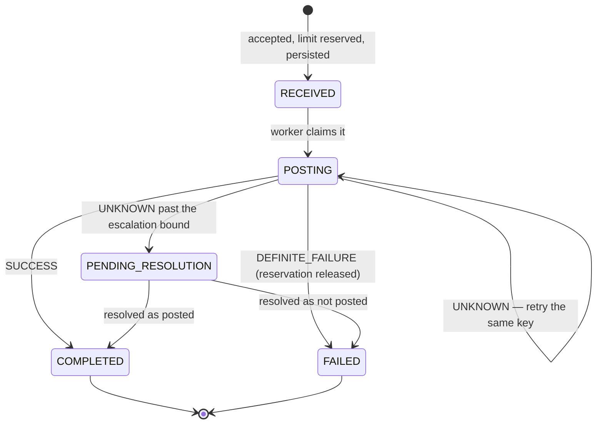

# Core — Saga Protocol & Recovery

**Status:** AGREED v1.24 (2026-08-10) — amendments via [`CHANGELOG.md`](CHANGELOG.md)

Read [`outcome-protocol.md`](outcome-protocol.md) first. This document describes
execution; that one describes the rule execution must obey.

## The state machine



`COMPLETED` and `FAILED` are terminal and never transition again.
`PENDING_RESOLUTION` is not terminal — it is a state with a human attached.

## Three phases, and the rule that separates them

**No database transaction is ever held open across an outbound call.** A
transaction spanning a network call holds locks and a pooled connection for the
duration of someone else's outage, and turns a partner's slowness into
connection-pool exhaustion. So every saga step is three phases:

### Phase A — decide and persist (one local transaction)

1. **Idempotency.** Look up `(tenant_id, channel_idempotency_key)`. Found with a
   matching payload fingerprint → return the original result. Found with a
   different fingerprint → `409 IDEMPOTENCY_KEY_REUSED`. Not found → proceed.
2. **Validate shape** — accounts present, amount positive and within bounds,
   currency consistent, no account on both sides.
3. **Ask Customer** (in-process interface): does this customer exist, is the
   status active, what KYC tier?
4. **Ask Product** (in-process interface): is this operation permitted, what fee
   applies, what limit applies, and **under which configuration version**?
5. **Reserve the limit** — insert a `RESERVED` row. The unique index arbitrates
   concurrent reservations; application code does not.
6. **Insert the saga row** in state `RECEIVED`, carrying the request
   fingerprint, a snapshot of the Product decision, the principal, and the
   service identity.
7. **Write `transfer.initiated`** to the orchestration outbox.
8. **Commit.**

Steps 5–8 are one transaction. That is the whole reason these three domains
share a database: the reservation and the saga cannot be allowed to disagree.

If any step fails, the transaction rolls back: no saga, no reservation, no
event, and the caller receives a definite 4xx. Rejections are total.

### Phase B — call the ledger (no transaction held)

9. Derive the idempotency key: `core:{saga_id}:{step}`. Pure function, never
   random, never time-derived.
10. Post the transaction — principal entries and fee entries in **one** balanced
    ledger transaction.
11. Classify the outcome as `SUCCESS`, `DEFINITE_FAILURE` or `UNKNOWN` per
    [`outcome-protocol.md`](outcome-protocol.md).

### Phase C — record the outcome (one local transaction)

| Outcome | Saga | Reservation | Event |
|---|---|---|---|
| `SUCCESS` | `COMPLETED`, ledger transaction id recorded | `CONSUMED` | `transfer.completed` |
| `DEFINITE_FAILURE` | `FAILED`, error code recorded | `RELEASED` | `transfer.failed` |
| `UNKNOWN` | stays `POSTING`, attempt count incremented, `next_attempt_at` set | **untouched** | none |
| `UNKNOWN` past the bound | `PENDING_RESOLUTION`, ops case raised | **untouched** | none |

The reservation is released **only** on definite failure. Releasing it on an
unknown would free limit headroom for a transfer that may already have posted.

## The claim protocol

Core runs multiple instances. Work is claimed from the database, never queued in
a JVM.

The saga row carries `claimed_by`, `claim_expires_at`, `attempts` and
`next_attempt_at`. A worker claims a batch:

```sql
SELECT ... FROM orchestration.sagas
 WHERE state IN ('RECEIVED', 'POSTING')
   AND next_attempt_at <= now()
   AND (claim_expires_at IS NULL OR claim_expires_at < now())
 ORDER BY next_attempt_at
   FOR UPDATE SKIP LOCKED
 LIMIT :batch
```

…sets `claimed_by` and `claim_expires_at = now() + lease`, commits, and then
does Phase B outside any transaction.

**Why a lease rather than the row lock alone:** the row lock cannot survive
Phase B, because Phase B must not hold a transaction. The lease is the
out-of-transaction equivalent — it makes a claim visible to other instances
without holding a connection. A worker that dies mid-call simply lets its lease
expire, and another instance reclaims the saga and retries the same derived key,
which is safe by construction.

Long work heartbeats by extending `claim_expires_at`. A lease that expires while
work is genuinely in flight causes a duplicate *attempt*, never a duplicate
*posting* — the ledger's idempotency registry absorbs it. That is the property
that makes an aggressive lease safe.

## Compensation

v1 has exactly one compensatable local effect: the limit reservation. It is
released in Phase C, in the same transaction that fails the saga, and only from
`DEFINITE_FAILURE`.

There is **no distributed compensation in v1**, because there is no step that
can succeed after another has failed — a single ledger posting is the only
external effect. Multi-step compensation arrives with the first rails connector
and is designed then, against a real second effect rather than an imagined one.

**Reservations are never swept independently of their saga.** The sweep operates
on sagas; a reservation is mutated only by the worker holding that saga's lease.
That makes the race with an active claim *structurally impossible* rather than
carefully avoided. `expires_at` on the reservation is a backstop against orphan
rows, not the primary mechanism.

**A saga in `PENDING_RESOLUTION` keeps its reservation, deliberately.** The money
may have moved. Releasing the headroom would admit a second transfer that,
combined with a first which may have committed, breaches the customer's limit —
converting an unknown outcome into a certain compliance breach.

## Two kinds of reversal

The word covers two operations that must never share a code path.

| | Compensating reversal | Business reversal |
|---|---|---|
| Initiated by | the saga itself | a human |
| Approval | **none — automated** | maker-checker, mandatory |
| Target | a posting **this saga made** | any `COMPLETED` saga |
| Trigger | a later step returned `DEFINITE_FAILURE` | judgement: error, dispute, fraud |
| When | within the saga's lifetime | any time afterwards |
| Discretion | zero | total |
| `initiated_by` | `system:core-saga-compensator` | the human principal |

**Maker-checker gates judgement, not mechanism.** An automated compensation
undoes exactly what its own saga just did, because the reason for doing it
evaporated; there is nothing for a second pair of eyes to evaluate. A business
reversal is somebody deciding that a transaction the system considers correct
should not stand.

### Compensating reversal (v2 — arrives with the first rails connector)

**Not present in v1**, because a single-step saga that fails has nothing posted
to undo. When multi-step sagas exist, the automated path is bounded by three
rules that keep it from becoming a way to move money without authorization:

1. It may target **only a posting recorded by the same saga** — never a
   transaction selected by a human, a query, or another saga.
2. It requires `DEFINITE_FAILURE`. **Compensating on `UNKNOWN` is forbidden**,
   which is the outcome protocol's central rule restated at the point where it is
   most tempting to break.
3. It happens inside the saga's lifetime, under the same derived-key discipline
   as any other step.

**A surge of compensations trips a circuit breaker and alerts.** A partner
failing at scale should halt the flow and wake someone, not silently reverse ten
thousand transactions. Compensations also surface in the ledger's
authorized-exposure report, which is where expected-but-notable money movement
belongs.

### Business reversal is its own saga

Reversal is not a state transition on the original saga. It is a new saga of
type `REVERSAL` that references the original:

- The original must be `COMPLETED` and carry a ledger transaction id.
- The reversal requires an **approval**, which lives in `orchestration` while
  Identity defines who may make and who may check (PRD §4.10 — definitions
  centralized, workflow enforced by the owning service). The approval is bound to
  its target and amount, is single-use, and enforces checker ≠ maker. An approval
  that could be replayed, or applied to a different amount, is not maker-checker.
- It calls the ledger's reverse endpoint with its own derived key.
- `409 ALREADY_REVERSED` classifies as `SUCCESS`: the response carries the
  winning reversal's id and the saga converges on it rather than retry-looping.
- The original saga stays `COMPLETED`. It is not rewritten; the reversal is a
  separate, linked record.

Modelling reversal as a second saga rather than a mutation is what keeps
terminal states terminal, and keeps the audit trail additive.

## Concurrency

- **The database arbitrates races, not application code.** A unique index on
  `(tenant_id, channel_idempotency_key)` decides duplicate submissions; a unique
  index decides duplicate reservations. A racing duplicate blocks until the first
  commits, then re-reads the winner's result.
- **Claims never overlap**, by `FOR UPDATE SKIP LOCKED` plus the lease.
- **Phase A takes locks in one order and holds them briefly**; Phase B holds
  none.
- Two sagas for one customer contend only on the reservation row for that
  customer's window, which is the intended serialization point.

## Post-restore reconciliation

If the Ledger is restored from backup it loses committed postings, and Core's
records become the more complete account of what was intended. Recovering is
**mechanical, not a judgement**, and requires no human decision about any
individual transaction:

| Saga state | Action |
|---|---|
| `COMPLETED` with a recorded ledger transaction id | `GET` it from the Ledger. Present → nothing to do. `404` → replay the derived key and record the new transaction id |
| `POSTING` / `PENDING_RESOLUTION` | Replay the derived key. Safe in both branches (see [`outcome-protocol.md`](outcome-protocol.md)) |
| `FAILED` | Nothing. No posting was made, so there is nothing to restore |

Replay is safe because the derived key is a pure function of `(saga_id, step)`
and survives everything — it is not stored state that a restore can rewind.

**In v1 this is operator-triggered, not automatic**, and the reason is a real
limitation rather than a preference: the Ledger stamps its epoch on published
events only, never on API responses, and Core consumes no events in v1. Core
therefore has no way to *observe* that a restore happened. The procedure is safe
to run at any time — it is idempotent by construction — so v1 runs it as a
documented recovery step.

Automatic detection arrives when Core consumes events and can compare the
Ledger's epoch against the one it last saw. Exposing the epoch on Ledger API
responses would allow it sooner; that is a Ledger contract change and belongs in
a Ledger amendment, not in an assumption made here.

## What v2 adds (designed, not built)

When the first rails connector arrives:

- **Holds.** A hold reserves funds across an external call whose outcome is not
  yet known. Its TTL is **derived, not chosen**: it must strictly exceed the
  connector's maximum outcome-resolution window — initial timeout plus the full
  status-query schedule plus margin. If a hold expires anyway, the fallback is a
  deterministic posting against a suspense account plus an ops case, never a
  silent write-off.
- **Multi-step sagas** with real compensation, and a step-level outcome table.
- **Status queries** as the first move in resolving an `UNKNOWN`, rather than
  blind retry.
- **Inbound events**, and with them consumer-side dedupe and epoch fencing.

None of this is built in v1, and the design says so rather than implying
otherwise.
