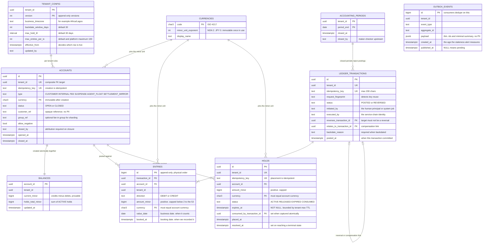

# Ledger — Data Model

**Status:** AGREED v1.11 (2026-08-08) — amendments via [`CHANGELOG.md`](CHANGELOG.md)

Thirteen tables. Amounts are integer minor units (`BIGINT`), currency on every
entry and account, `tenant_id` on **every** row — including holds and outbox.

**Glossary — `available`:** everywhere these docs say available, it means
exactly `current_minor − holds_total_minor`. This is the quantity the
negative-balance guard, `INSUFFICIENT_FUNDS`, and Invariant 4 operate on.

## ER diagram

## Relationships & rules

**Transaction → entries (1:N; 2 ≤ N ≤ the tenant cap, platform maximum 100).**
The atomic unit: balanced per currency, committed all-or-nothing. The entry
cap prevents a contract-legal transaction from locking thousands of balance
rows; bulk disbursements are many transactions orchestrated upstream.

**Idempotency registry (transactions, holds, accounts).** Unique
`(tenant_id, idempotency_key)` on **all three** money-relevant creations —
retried hold placement can never double-reserve funds; retried account
creation can never orphan a duplicate. Each transaction also stores a
`request_fingerprint` (hash of the canonical payload): same key + same
fingerprint → replay of the original result; same key + **different**
fingerprint → hard `409 IDEMPOTENCY_KEY_REUSED`, never a silent wrong answer.
The registry binds **committed** operations only — a rejected posting leaves no
registration and the key remains free (see api.md for the caller contract this
implies). Keys retained with entries ≥ 7 years.

**Account → balance (1:1).** The balance row is inserted in the same database
transaction that creates the account — a posting can never find the account
without its lockable balance row. Balance is derived, provable state
(credit-positive / liability-normal convention — resolved, see design.md).

**Account lifecycle.** `currency`, `type`, and `tenant_id` are immutable after
creation — enforced by trigger, not convention, matching the tamper-evidence
standard set for entries. Closure requires balance = 0 **and** no ACTIVE
holds, acquires the balance row lock (serializing against in-flight postings),
and records `closed_by`/`closed_at`. Closed accounts reject new postings —
**except reversals**, which may post into CLOSED accounts (undoing must always
be possible), **and the residue sweep that reversals make necessary**: when a
reversal leaves a CLOSED account with a nonzero balance, exactly one further
posting class is permitted — a sweep that returns the account to zero, whose
counterparty is a same-tenant SUSPENSE-type account. Anything else remains
`ACCOUNT_CLOSED`. Without this rule, reversal residue in a closed account
would be permanently unreachable: closure demands zero, ordinary postings are
rejected, and reopen does not exist. There is no reopen; a new account is
created.

**Reversal (0..1, self-reference, constrained).** A reversal mirrors the
original's entries. Structural rules, all schema-enforced: an original can be
reversed at most once (partial unique index); a reversal's target must not
itself be a reversal (trigger) — "reversing a reversal" silently resurrects
money-movement while every status looks terminal, so the correct correction is
always a fresh transaction.

**Reversal and compensation are mutually exclusive — in both directions.**
A transaction with `relates_to_transaction_id` compensations blocks plain
reversal of its target (`HAS_COMPENSATIONS`); and a compensation whose target
is already REVERSED is rejected (`TARGET_REVERSED`) — reverse T (full undo)
then post a "partial refund of T" is the same double-credit with the
operations swapped. The exclusion is race-safe: both reversal and
compensation-posting take a row lock on the original transaction, so the two
can never commit concurrently; whichever commits first excludes the other.

**Holds.** `expires_at` is NOT NULL with a tenant-configurable maximum TTL
(default 30 days) — an unbounded hold is a permanent lien on customer funds
and is structurally impossible. Hold currency must equal account currency.
Status transitions: `ACTIVE → RELEASED | EXPIRED | CONSUMED` (consumed =
atomically captured by a posting; see posting-algorithm.md). Terminal states
never transition again. **Capture semantics are single-shot, decided:** a
capture for less than the hold amount consumes the hold entirely and the
remainder's reservation is released *explicitly* — the `hold.released` event
carries `capturedMinor` and `releasedRemainderMinor`, never a silent
disappearance. Multi-capture is not supported in v1 (orchestration places a
new hold if a further reservation is needed). **Reversing a hold-consuming
transaction does not resurrect the hold** — reversal restores balances, never
reservations; the hold stays CONSUMED.

**Accounting periods.** Once a tenant closes a period (via
`POST /v1/periods/{end}/close` — attributed, maker-checker upstream, no
reopen), postings whose `value_date` falls inside it are rejected —
signed-off regulatory reports stay reproducible forever. Backdated postings
(value_date < current business date) additionally require a `backdate_reason`
and are bounded by a tenant window (default ≤ 30 days); future value dates
are rejected outright.

**Tenant configuration.** Business timezone, backdate window, max hold TTL,
and per-tenant caps live in `tenant_config` — append-only versioned rows,
attributed, seeded by the provisioning script pre-Identity-service.

Selection is unambiguous: the applicable row is the highest `version` whose
`effective_from` is ≤ now. `version` orders the history and breaks ties;
`effective_from` decides which row is live. **Validation always uses the
config live at the moment of posting, never the config live at the entry's
`value_date`** — a backdated posting is validated by today's rules. The
alternative (validating a backdated entry under a superseded config) would
make the same request succeed or fail depending on a date the caller chose,
which is not a property a ledger should have. History is retained so that any
past posting's validation context is reconstructible for audit, not so that
it can be re-applied.

**Currency reference data.** `currencies` (ISO 4217 code +
`minor_unit_exponent`) pins what a minor unit *is* — without it, "amount in
minor units" is ambiguous (NGN has exponent 2, JPY 0). Accounts, entries, and
holds FK to it; ledger arithmetic never needs the exponent (integers all the
way down), but validation, rendering, and reporting do. Seeded per country
pack (NGN first); adding a currency is a reference-data insert, never a
schema change.

**Dual attribution (two columns, matching the security architecture).**
`initiated_by` records the human principal (or named system job);
`executed_by` records the service-chain identity from the mTLS/service token.
Regulators expect to see *who asked* and *which system acted*, separately — one
collapsed column cannot answer both questions.

**Schema migration discipline (implementation-blocking, so decided here).**
The schema's correctness lives in triggers, partial unique indexes, composite
FKs, and RLS policies — objects a casual migration can silently drop. Rules:
Flyway versioned migrations, append-only (an applied migration is never
edited — corrections are new migrations); every constraint, trigger, index,
and RLS policy is created in a migration, and a **schema-presence test suite**
asserts each one exists and fires (testing.md) — a migration that loses a
trigger fails CI, not an audit; zero-downtime changes follow expand→migrate→
contract (constitution #9: no downtime windows); `CREATE INDEX CONCURRENTLY`
for indexes on hot tables (outside transactional migrations, with Flyway's
non-transactional marker); migrations are tested both stepwise
(V1→V2→…→Vn) and fresh-install (empty→Vn) and the two must converge to
identical schemas.

**Two dates on every entry — the industry requires both.** `booked_at` is
when the ledger *recorded* the entry; `value_date` is when it *counts*. They
are equal for ordinary postings and differ for backdated ones. Both ISO 20022
`camt.053` (`BookgDt` / `ValDt`) and SWIFT MT940 (`:61:` value date + entry
date) mandate both on every statement line, so a single date would make
compliant statement export impossible. Two dates are also what let a customer
read a backdated item correctly — "booked 4 Aug, value 15 Jun" — rather than
finding an unexplained entry in the middle of June. `booked_at` additionally
gives as-of reporting its natural predicate (`booked_at <= X`), which is
simpler and more explainable than reconstructing a position from entry ids.

**Timestamps are present wherever a lifecycle moment is auditable or
operable:** `accounts.opened_at`/`closed_at`, `ledger_transactions.posted_at`,
`entries.booked_at`, `balances.updated_at`, `holds.placed_at`/`resolved_at`,
`accounting_periods.closed_at`, `outbox_events.created_at`. The outbox one is
load-bearing rather than decorative — architecture.md alerts on
oldest-unpublished *age*, which cannot be computed without it.

**Tenant registry.** `tenants` is the table a tenant must appear in before it can hold money.
Row-level security isolates tenants from each other; it has nothing to say about whether a tenant
is *real*, and until this existed any well-formed UUID in a request header produced a working,
empty ledger with platform defaults. `accounts` and `tenant_config` now carry a foreign key to it.
Deliberately not row-level secured — a request has to be able to ask "is this tenant real?" before
it has a tenant context to be scoped by — and it holds a name and a status, no money and no PII.

**It is a local projection, not a join.** The ledger makes no synchronous outbound calls, so it
cannot ask Identity "is this tenant real?" while a posting is in flight: that would put another
service's availability directly in the money path, which is the coupling this service exists
without. Instead it keeps the smallest possible local copy of the answer — an id, a name, a status.
Nothing about the customer, their KYC tier, their products or their contact details. If the ledger
would need to know *why* a tenant exists, it does not belong here.

**Populated by provisioning, not by consuming events.** Tenant lifecycle is rare, deliberate and
attributed: a bank is onboarded, or suspended, by an operator running a versioned script — the same
path that seeds `tenant_config`. That keeps "events consumed: NONE, EVER" exactly true. Subscribing
to a tenant feed would make the ledger's ability to accept money depend on a message arriving, and
a missed message would mean a real bank silently unable to transact. A provisioning step that fails
is visible immediately to the person running it.

**Ledger epoch.** `ledger_epoch` is a single enforced row carrying the restore generation, stamped
onto the outbox row at write time and published as the envelope's `epoch` (ADR 0008; it was a
payload field named `ledgerEpoch` until v1.7). A restore from backup rewinds the outbox: ids
consumers have already seen become available again, and the events written under them may describe
different money. Without a generation marker a consumer cannot tell a genuine at-least-once
redelivery from a post-restore replay of a different history — both look like an outbox id it has
seen before. `advance_ledger_epoch(reason)` is the only way to change it, and the reason is not
optional.

**Verification tables.** `balance_anchors` holds one immutable, proven checkpoint per account
per day; `invariant_runs` records each verification pass with its findings. An anchor keys on an
**entry-id upper bound** rather than a date, and that bound is finalized only at an MVCC quiesce
horizon — every write transaction older than the capture snapshot has completed. Without that,
an entry could commit *below* a bound after it was proven, leaving the anchor quietly wrong
forever. Anchors are trigger-protected against update and delete for the same reason: every
incremental check since has trusted them.

`invariant_runs` separates **violations** from **authorized exposures**. A violation is a bug and
pages; an exposure is the routine, explained consequence of a reversal bypassing the
negative-balance guard, and is tracked and aged instead. Keeping them apart is what lets "zero
violations" stay both achievable and meaningful — an alarm that fires routinely is an alarm people
learn to ignore.

**Physical order vs business order (decided).** Entry `id` is *physical*
insertion order — the order invariant anchors and change feeds care about.
`value_date` is *business* order — the order statements and as-of reports
present. They deliberately differ: a backdated posting changes what the
balance "as of" a prior date reads — that is the *purpose* of value dating,
bounded by the backdate window and period close (which is precisely the
guarantee that signed-off as-of reports can never change). As-of-date
reporting is a read-model concern; it never feeds invariants
(see testing.md).

**Cross-tenant impossibility.** All FKs are composite on `(tenant_id, id)` —
an entry, hold, or reversal referencing another tenant's row violates a
constraint before any application code runs. RLS remains the backstop, with
the `SET LOCAL` discipline specified in architecture.md.

**`group_ref` is the one identifier not covered by a composite FK — and how
it is scoped anyway.** Fan-in group membership is a free-text label on
`accounts`, not a key, so two tenants may legitimately both name a group
`fees-pool`. The group-balance read is scoped structurally regardless: it
resolves members by selecting `accounts`, and RLS forbids a session from
seeing any tenant's account rows but its own, so a cross-tenant group can
never be assembled in the first place. This is stated explicitly because it
is the sole place in the schema where isolation rests on RLS rather than on a
foreign key, and an unstated exception is how exceptions become bugs. A
tenant-isolation test pins it (see testing.md).

**Outbox.** Written in the same database transaction as the state change.
Carries `tenant_id` and `aggregate_id`; payloads are thin (ids + minimal
summary — consumers fetch state via the read API). Published rows are purged
after 30 days: the entries tables are the 7-year audit record, the outbox is a
delivery queue, never an archive.

## Hard rules encoded in the schema (not just in code)

1. **Append-only entries** — trigger rejects UPDATE/DELETE.
2. **Immutable account identity** — trigger rejects changes to currency, type,
   tenant_id.
3. **Positive, bounded integer amounts** — `CHECK (amount_minor > 0 AND
   amount_minor <= 10^15)`. The cap sits far below BIGINT overflow *and* below
   2^53, so entry amounts survive any IEEE-754/JSON consumer exactly.
   **Balances are uncapped sums** and may exceed 2^53 (group balances
   especially) — which is why the API serializes all monetary *response*
   fields as decimal strings (api.md).
4. **Currency integrity** — entry/hold currency must equal account currency.
5. **One reversal max; never of a reversal** — partial unique index + trigger.
6. **Idempotency on every creation** — unique keys on transactions, holds,
   accounts.
7. **Tenant isolation** — tenant_id on every row, composite FKs, RLS backstop.
8. **No unbounded holds** — `expires_at NOT NULL`.
9. **Immutable currency exponent** — trigger rejects any change to
   `minor_unit_exponent` once a currency is referenced by any account. It is
   the only value in the schema that reinterprets *every* stored amount at
   once: flipping NGN from 2 to 0 would silently turn ₦1,000.00 into
   ₦100,000.00 across every tenant, with no entry modified, no balance moved,
   and every invariant still passing. A redenomination is a new currency code
   and a migration, never an `UPDATE`.

## Explicitly decided edge cases

- **Wash transactions rejected:** no account may appear on both the debit and
  credit side of one transaction. A "balanced" pair that moves nothing exists
  only to inflate volumes or plant text in the immutable audit record; there
  is no legitimate v1 use. (Revisit only with a concrete accounting need,
  via ADR.)
- **Zero-amount entries rejected** at the API boundary (422), not just by the
  CHECK constraint.
- **Idempotency key limits:** ≤ 200 characters, printable ASCII.

## What is deliberately absent

No customer names, KYC data, product references, fee descriptions, or channel
information. `customer_ref`, `initiated_by`, `description` are opaque
caller-supplied strings. Joining money to meaning happens downstream in the
analytical store — never here.
